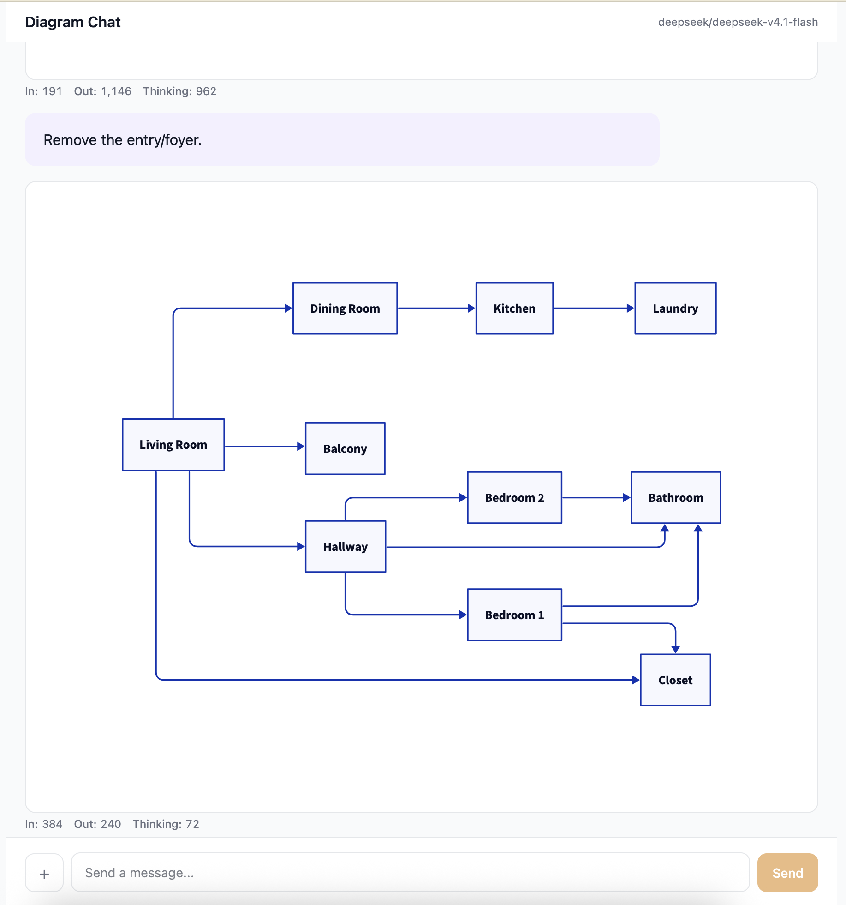

# Diagram Chat

An experimental tool for exploring diagramming interactions with an LLM agent. Chat with a model and get back rendered diagrams in real time.



## Supported diagram types

- **D2** — declarative diagrams via [D2](https://d2lang.com)
- **Mermaid** — flowcharts, sequence diagrams, etc.
- **XML** — raw SVG / XML diagram markup

## Token metrics

Each message displays token usage and cost, making it easy to compare how different prompting strategies affect spend.

## Setup

Requires an [OpenRouter](https://openrouter.ai) API key.

```
cp .env.example .env   # add your OPENROUTER_API_KEY
npm install
npm run dev
```

The client runs on Vite's dev server and the Express backend proxies model requests through OpenRouter.
